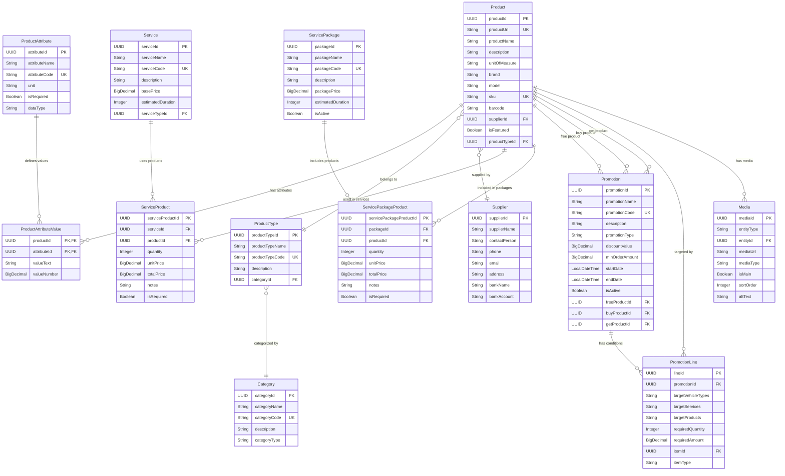
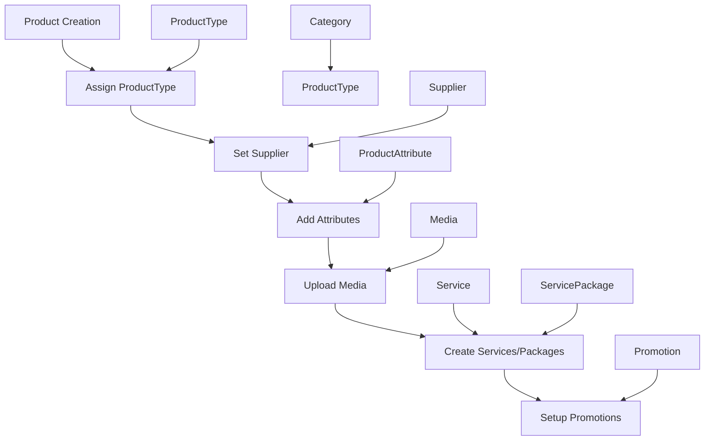

# 🏗️ Sơ Đồ Tổng Quan - Mối Liên Kết Product với Các Entity

## 📊 Entity Relationship Diagram

## 🔗 Chi Tiết Mối Quan Hệ

### 1. **Product Core Relationships**

#### **🏷️ ProductType (Many-to-One)**
- **Relationship**: `Product` → `ProductType`
- **Type**: Many-to-One (N:1)
- **Description**: Một Product thuộc về một ProductType
- **Implementation**: `@ManyToOne` với `@JoinColumn(name = "product_type_id")`

#### **📋 ProductAttribute (Many-to-Many)**
- **Relationship**: `Product` ↔ `ProductAttribute`
- **Type**: Many-to-Many (N:M)
- **Bridge Table**: `ProductAttributeValue`
- **Description**: Product có nhiều attributes, Attribute áp dụng cho nhiều products
- **Implementation**: Composite Primary Key với `@IdClass(ProductAttributeValueId)`

#### **🏢 Supplier (One-to-Many)**
- **Relationship**: `Supplier` → `Product`
- **Type**: One-to-Many (1:N)
- **Description**: Một Supplier cung cấp nhiều Products
- **Implementation**: Direct UUID reference (`supplier_id` column)

### 2. **Business Relationships**

#### **🔧 Service Integration**
- **ServiceProduct**: Bridge table giữa Service và Product
- **Relationship**: Service sử dụng Products với quantity và pricing
- **Fields**: `quantity`, `unitPrice`, `totalPrice`, `isRequired`

#### **📦 Package Integration**
- **ServicePackageProduct**: Bridge table giữa ServicePackage và Product
- **Relationship**: Package bao gồm Products với quantity và pricing
- **Fields**: `quantity`, `unitPrice`, `totalPrice`, `isRequired`

#### **🎁 Promotion Integration**
- **Direct References**: Product có thể là `freeProduct`, `buyProduct`, hoặc `getProduct`
- **PromotionLine**: Target products trong promotion conditions
- **Fields**: `targetProducts` (JSON array), `itemId`, `itemType`

### 3. **Media Integration**

#### **📸 Generic Media System**
- **EntityType**: `PRODUCT` trong Media entity
- **Relationship**: Product có nhiều Media items
- **Fields**: `entityType`, `entityId`, `mediaUrl`, `isMain`, `sortOrder`

## 📊 Relationship Summary Table

| Entity | Relationship Type | Description | Implementation |
|--------|------------------|-------------|----------------|
| **ProductType** | Many-to-One | Product belongs to ProductType | `@ManyToOne` |
| **ProductAttribute** | Many-to-Many | Product has multiple attributes | Bridge table `ProductAttributeValue` |
| **Supplier** | One-to-Many | Supplier provides multiple products | Direct UUID reference |
| **Service** | Many-to-Many | Service uses multiple products | Bridge table `ServiceProduct` |
| **ServicePackage** | Many-to-Many | Package includes multiple products | Bridge table `ServicePackageProduct` |
| **Promotion** | One-to-Many | Promotion targets multiple products | Direct references + JSON arrays |
| **Media** | One-to-Many | Product has multiple media items | Generic media system |

## 🎯 Key Features

### **✅ Flexible Attribute System**
- Dynamic attributes through `ProductAttributeValue`
- Support for text and numeric values
- Required/optional attributes

### **✅ Business Integration**
- Service-Product relationships with pricing
- Package-Product bundling
- Promotion targeting

### **✅ Media Management**
- Generic media system
- Multiple media per product
- Main media designation

### **✅ Supplier Management**
- Direct supplier reference
- One-to-many relationship

## 🔄 Data Flow

## 🚀 API Endpoints Summary

| Entity | CRUD Operations | Special Endpoints |
|--------|----------------|-------------------|
| **Product** | ✅ Full CRUD | Filter by ProductType, Supplier, Attributes |
| **ProductType** | ✅ Full CRUD | Filter by Category |
| **ProductAttribute** | ✅ Full CRUD | Filter by DataType, Required |
| **ProductAttributeValue** | ✅ Full CRUD | Bulk operations |
| **Media** | ✅ Full CRUD | Entity-specific queries |
| **Supplier** | ✅ Full CRUD | Product count by supplier |

**Sơ đồ này thể hiện toàn bộ mối liên kết giữa Product và các entity khác trong hệ thống SCSMS!** 🎯
